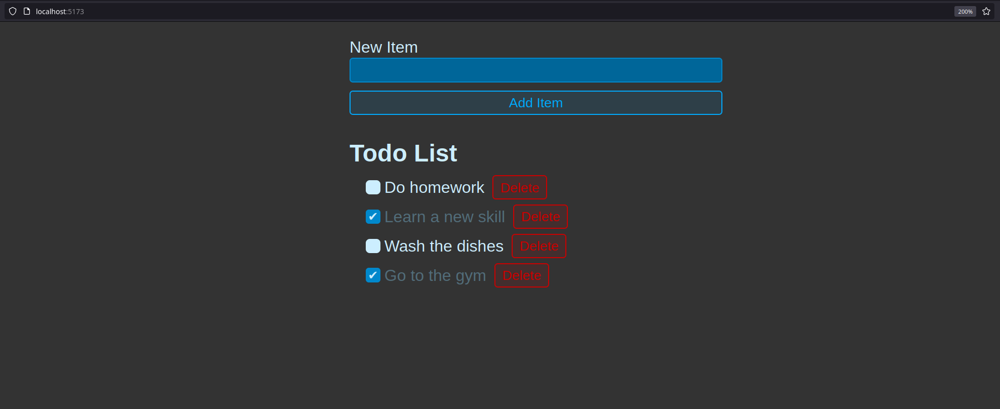

# Simple Todo List Using React

This is a simple todo list application using React. It is a simple application that allows you to add, delete, and mark tasks as completed.

Heres a screenshot of the application:

